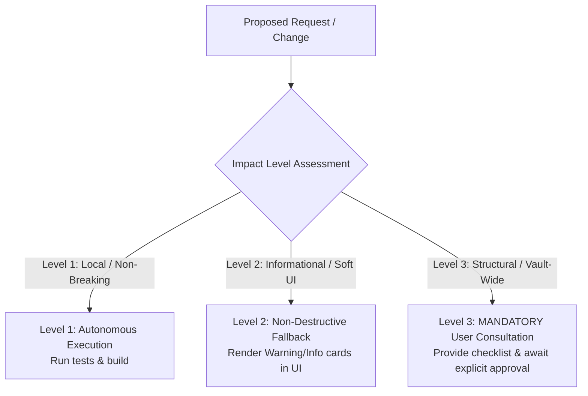

# Citation Manager: Architectural Blueprint & Plugin Structure

## 1. Core Tenets & Bucket Architecture

1. **Zero External Lock-In**: Citations stored locally as YAML-frontmatter markdown notes (`.references/<citekey>.md`) with raw attachments (`.references/attachments/<citekey>.pdf`) and plugin settings in standard Obsidian `data.json`.
2. **Citation Buckets**: Projects are represented as **Citation Buckets** (`ProjectRecord`), declared via YAML frontmatter (`citation-manager: ["BucketName"]`) and managed with 1-click status bar affordances.
3. **Single Unified Citation Standard**: In-body format and bibliography style are governed by a single dropdown per bucket (`APA 7`, `APA 7 Narrative`, `IEEE [1]`, `Harvard`, `Chicago`, `Vancouver`, `Pandoc Citekey [@key]`).
4. **Direct Editor Insertion & Global Footnote Mode**: Active drafting insertions use Obsidian Editor API (`editor.replaceRange`). Never rewrite open files asynchronously via `vault.modify` or `trim()` to prevent external modification alerts and whitespace loss. Footnote Mode is a global toggle that propagates note updates on demand.

---

## 2. Directory & Component Structure

```
obsidian-citation-manager/
├── src/
│   ├── backend/                     # Core Business Logic, Storage & CSL Engines
│   │   ├── types.ts                 # TypeScript interfaces (ReferenceMetadata, ProjectRecord, ProjectExportSettings)
│   │   ├── logger.ts                # Ring-buffered in-memory execution logger
│   │   ├── storageManager.ts        # Vault adapter I/O (.references/*.md, attachments/*.pdf, data.json)
│   │   ├── projectIndexer.ts        # High-level Facade for document indexing & corpus management
│   │   ├── citationEngine.ts        # High-level Facade for CSL formatting & bibliography generation
│   │   ├── metadataResolvers.ts     # High-level Facade for multi-identifier metadata resolution
│   │   ├── lintEngine.ts            # Diagnostic linter engine, Levenshtein distance & fuzzy remediation
│   │   ├── csl/                     # CSL Sub-package (Formatters, Sorter, BibTeX Generator)
│   │   ├── indexing/                # Indexing Sub-package (FormatPropagator, MarkdownMasker, PDFScanner)
│   │   └── resolvers/               # Identifier Resolvers (DOI, arXiv, ISBN, URL, BibTeX)
│   ├── frontend/                    # Decoupled UI Components & Modular SCSS
│   │   ├── styles/                  # Global SCSS Tokens & Mixins (_variables.scss, _base.scss, main.scss)
│   │   ├── CitationManagerView/     # Main sidebar view (.ts, .module.scss, index.ts)
│   │   ├── CitationCardRenderer/    # Card & chip UI renderer (.ts, .module.scss, index.ts)
│   │   ├── FixInconsistenciesModal/ # Diagnostics accordion modal (.ts, .module.scss, index.ts)
│   │   ├── ReferenceEditorModal/    # Add/Edit citation modal (.ts, .module.scss, index.ts)
│   │   ├── InsertCitationModal/     # Multi-citation suggest modal (.ts, .module.scss, index.ts)
│   │   ├── PDFImportModal/          # PDF dropzone & DOI scanner (.ts, .module.scss, index.ts)
│   │   ├── BibliographyModal/       # Bibliography modal (.ts, .module.scss, index.ts)
│   │   ├── ExportPublicationModal/  # Publication export modal (.ts, .module.scss, index.ts)
│   │   ├── CitationNotesModal/      # In-card notes modal (.ts, .module.scss, index.ts)
│   │   ├── CollectionEditorModal/   # Collection manager modal (.ts, .module.scss, index.ts)
│   │   ├── CollectionTransferModal/ # Transfer modal (.ts, .module.scss, index.ts)
│   │   ├── MoveToCollectionModal/   # Move citation modal (.ts, .module.scss, index.ts)
│   │   ├── editorSuggest/           # Autocomplete suggester (.ts, .module.scss, index.ts)
│   │   ├── settingsTab/             # Plugin configuration tab (.ts, .module.scss, index.ts)
│   │   └── index.ts                 # Master frontend barrel export
│   └── main.ts                      # Plugin lifecycle, file watchers, commands, context menus
├── tests/                           # 27 In-Repo Automated Test Suites (1,920+ Assertions)
├── public/styles.css                # Compiled production stylesheet
└── esbuild.config.mjs               # Bun/Node production bundling & SCSS pipeline
```

### 2.1 Architectural Invariants & Coding Guardrails
1. **Facade 100% Signature Invariant**: When decomposing monolithic engines into sub-packages, ALL existing public static and instance methods on facade classes (`CitationEngine`, `ProjectIndexer`, `MetadataResolvers`) must be strictly preserved and delegate to submodules. Never delete or rename methods (e.g., `compileProjectCorpus`, `cleanExportFrontmatter`, `generateBibTeX`) to prevent runtime call failures across views and modals.
2. **Native Tool Editing Constraint**: Always use native tools (`replace_file_content`, `write_to_file`) directly instead of creating intermediate scratch Node scripts when modifying codebase files.
3. **Strict Zero-Emoji Policy**: Enforced across all UI views, status notices, modals, logs, and artifacts. Use Lucide SVG icons exclusively (`setIcon(el, "...")`).
4. **Obsidian Vault Adapter Directory Creation**: Use `app.vault.adapter.mkdir(pubDir)` for custom publication and export directory creation to prevent vault path collisions.

### 2.2 UI Styling & Surface Invariants
1. **Solid Card Surface Persistence**: Never replace a card container's solid background (`background: var(--background-secondary)`) with `var(--background-modifier-hover)` on `:hover`. In many user themes and custom CSS snippets, `--background-modifier-hover` has low or zero opacity, which makes the entire card transparent and see-through. Always maintain solid surface opacity and highlight cards on hover via `border-color: var(--interactive-accent)` and subtle `box-shadow`.
2. **Accordion Header Persistence**: When expanding inline accordion items (e.g. Citation Card Notes), keep the section title and chevron permanently visible across both collapsed and expanded states.
3. **Button Flex Alignment**: Enforce `display: inline-flex; align-items: center; justify-content: center; line-height: 1;` across all buttons and pills, stripping leading whitespace strings from text spans to guarantee mathematical icon-text centering.


---

## 3. Subsystem Specifications

### 3.1 Tamper-Proof Markdown Parsing & Masking
* **Masking Engine (`maskIgnoredMarkdown`)**:
  1. Frontmatter: `^---[\s\S]*?---\n?`
  2. Fenced code blocks: `(?:```|~~~)[^`~]*?[\s\S]*?(?:```|~~~)`
  3. HTML comments: `<!--[\s\S]*?-->`
  4. LaTeX display math: `\$\$[\s\S]*?\$\$`
  5. LaTeX inline math: `\$(?!\s)[^\$\n]+(?<!\s)\$`
  6. Inline code: `` `[^`\n]+` ``
  *Guarantee*: Math equations (e.g. `$x \in [1, 2]$`, `$$\mathbf{A} = [1, 0]$$`), programming snippets, and draft comments NEVER trigger false citation matches or warnings.
* **Character Set**: Supports Pandoc / Zotero citekeys `[a-zA-Z0-9_:\.-]+` (including colons and accents).
* **Multi-Citation Insertion**: Inserts space-separated individual tokens (`[@Baltar2012] [@Spielberg2016]`) to prevent syntax overloading across parsers.

### 3.2 Publication & Compilation Pipeline
* **Frontmatter Stripping (`cleanExportFrontmatter`)**: Removes all `citation-manager:` / `citation_manager:` metadata blocks from exported notes so copies in `publication/` are never indexed back as source documents.
* **Corpus Batch Compilation (`compileProjectCorpus`)**: Gathers all linked notes in a bucket, computes a unified sequential numeric index (e.g. IEEE `[1..N]`, Vancouver `(1..N)`), batch compiles all notes to `[outputFolder]/[FileName].md`, and generates `[outputFolder]/References - [BucketName].md`.
* **Folder Picker (`FolderPickerModal`)**: Provides an interactive vault directory browser and saves custom export destinations per bucket.

### 3.3 Search & Acquisition Shortcuts
* **Search Bar Fetching**: Pasting/typing a DOI, arXiv ID, ISBN, or URL into the top search bar and pressing `Enter` directly triggers metadata resolution and opens `ReferenceEditorModal` pre-filled.
* **Tab-Safe PDF Leaf**: Opens attached PDF files via `workspace.getLeaf('tab').openFile(file)` for clean workspace tab preview.
* **Absolute Desktop Shell Path Resolution**: On Windows virtual / shortcut drive mappings, resolve disk paths via `path.resolve(basePath, ref.pdfAttachment)` with `electron.shell.openPath` to prevent string truncation.
* **PDF Binary DOI Verification**: When attaching PDFs, scan the binary for an embedded DOI and compare against `ref.doi` to display Match, Mismatch, or Unknown status badges. Preserve open accordion state on attachment/detachment.

### 3.4 3-Tier Citation Presence Scan Strategy
Detection of citation presence to count citations towards the manager (`Cited (Nx)`, `referenceUsageMap`, and `totalCitationsInFiles`) follows a strict 3-tier hierarchy across all modes:
1. **Tier 1: Footnote Identifier (`[^key]`)**: Scans in-body footnote calls `\[\^([a-zA-Z0-9_:\.-]+)\](?!:)` $\to$ matches against library citekeys $\to$ records occurrence in `referenceUsageMap`.
2. **Tier 2: Footnote Body / Bottom Definition (`[^key]: ...`)**: Scans bottom definitions $\to$ links definition snippet $\to$ if not already recorded from in-body, counts occurrence in `referenceUsageMap`.
3. **Tier 3: Identifier In-Body Text & Plain Reference Entries**:
   - Pandoc Citekeys: `[@key]` / `[@key1; @key2]`.
   - Parenthetical text citations: `(Author, Year)`, `(Author Year)` *(Harvard/Chicago)*, and multi-citations `(AuthorA, Year; AuthorB, Year)` matched via `authorYearIndex`.
   - Narrative text citations: `Author et al. (Year)` / `Author (Year)`.
   - Un-prefixed bottom reference entries: Matches note lines against `ref.title`.

### 3.5 Authoritative Converged Linting Matrix
Document diagnostics and transformations follow a 2-dimensional matrix (**Active Style $\times$ Footnote Mode**):

| Mode State | In-Body Invariant & Fix | Bottom Definition Invariant & Fix |
| :--- | :--- | :--- |
| **Footnote Mode ON** | In-body must be `[^key]`. Flag non-footnote tokens (`(Author, Year)`, `[@key]`, `Author (Year)`) $\to$ `suggestedFix: [^key]`. | Must have `[^key]: <Formatted Entry>`. Flag style mismatches $\to$ `suggestedFix: <authoritative definition>`. |
| **Footnote Mode OFF** | In-body must match bucket standard (e.g. `(Author, Year)` for APA 7, `(Author Year)` for Harvard, `[1]` for IEEE). Flag `[^key]` $\to$ `suggestedFix: targetInBody`. | Must have un-prefixed `<Formatted Entry>`. Flag `[^key]: ` stubs $\to$ `suggestedFix: <Formatted Entry>` (strips prefix, retains 100% reference text). |
| **Orphan Definition (Both Modes)** | N/A (Missing in-body call) | Flag unreferenced bottom definition line $\to$ Badge: **`Orphan`**, `suggestedFix: ""` (1-click removal). |

### 3.6 Diagnostic Accordion UI Standard & Reactive Linter Invariants
* **Side Panel & Modal Accordion UI Standard**:
  Diagnostics rendered in `FixInconsistenciesModal.ts` and `CitationManagerView.ts` (Health & Stats Subpanel $\to$ Diagnostics tab) must follow the standardized 2-state accordion format:
  - **State 1 (Collapsed)**: `[>] [Severity Icon] [Short Title] [File:Line] [Dismiss (Trash) Button]`
  - **State 2 (Expanded)**: `[v] [Severity Icon] [Short Title] [File:Line] [Dismiss (Trash) Button]`
    - Explanation box (`w.explanation || w.message`)
    - Proposed Solution / Diff Preview: `diff-old` $\to$ `diff-new`
    - Contextual Action Buttons: `[Apply Fix]`, `[+ Create Entry]`, `[Purge]`, `[Dismiss]`, `[Inspect]`
* **Live Reactive Refresh Invariant**:
  Any diagnostic remediation action (`Apply Fix`, `Batch Apply`, `+ Create Entry`, `Purge`, `Dismiss`) inside `FixInconsistenciesModal` must trigger an asynchronous re-index through `refreshWarningsFromParent()` and update the modal's warning list dynamically in-place without closing or re-opening the modal.
* **Complete Resolution Tree**:
  1. `[+ Create Entry]`: Pre-populates `ReferenceEditorModal` with citekey and note definition text.
  2. `[Purge]`: Completely removes the reference token, in-body calls, and full multi-line footnote definition bodies from the note.
  3. `[Dismiss]`: Serializes dismissal to `.references/.cache/dismissed_lints.json`.
* **Sequential Numeric Footnote Indexing**: IEEE (`[N]`) and Vancouver (`(N)`) footnote checks must calculate the 1-based sequential occurrence index in the document to prevent false-positive style mismatch warnings on nth citations.
* **Bi-Directional Mode Switching**:
  - Enabling Footnote Mode: Converts all in-body citations to `[^key]` and updates bottom definitions to `[^key]: <Formatted Entry>`.
  - Disabling Footnote Mode: Converts all in-body `[^key]` to standard format and strips `[^key]: ` prefixes from bottom definitions, retaining 100% of bibliographic text.

### 3.7 Academic Name & Numeric Narrative Standards
1. **IEEE & Vancouver Narrative Citations**:
   - Parenthetical: `[1]` (IEEE) / `(1)` (Vancouver)
   - Narrative: `Chen et al. [1]` (IEEE) / `Chen et al. (1)` (Vancouver)
2. **Compound Names & Suffix Parsing**:
   - Hyphenated first names: `"Jean-Paul Sartre"` $\to$ `"Sartre, J.-P."`
   - Suffixes: `"Martin Luther King Jr."` $\to$ `"King, Jr., M. L."` (APA) / `"King Jr. (1963)"` (Narrative)
3. **Multi-Author Narrative vs. Parenthetical Conjunctions**:
   - APA 7: Parenthetical uses `&` `(Smith & Jones, 2024)`, Narrative uses `and` `Smith and Jones (2024)`.
   - Chicago & Harvard: Always use `and` `(Smith and Jones 2024)` / `(Smith, Jones, and Brown 2024)`.

### 3.8 Context-Aware Citation Overloading & In-Place Merging (`detectAndOverloadAtCursor`)
When inserting a citation while the cursor is inside or adjacent to an existing citation:
* **Pandoc Citekey**: Merges into a single bracket separated by semicolons (`[@Smith2020; @Jones2021]`).
* **Author-Date (APA 7th, Harvard, Chicago)**: Merges into a single parenthetical sorted alphabetically by author surname (`(Jones & Brown, 2021; Smith, 2020)`).
* **IEEE Numeric**: Combines indices into a single bracket array (`[1, 2]`).
* **Vancouver Numeric**: Combines indices into a single parenthesis array (`(1, 2)`).
* **Footnote Mode ON**: Appends adjacent footnote token immediately after the existing anchor (`[^Smith2020][^Jones2021]`).

### 3.9 Atomic Multi-Citation Group Linting
The linter treats grouped multi-citations (`[@A; @B]`, `(A, 2020; B, 2021)`, `[1, 2]`, `(1, 2)`) as atomic syntax entities:
* Registers all participant citekeys into `inBodyKeysInFile` and `referenceUsageMap`.
* If a format mismatch occurs (e.g. Footnote Mode is ON but note contains `(A, 2020; B, 2021)`), emits a **single unified diagnostic item** with `suggestedFix: [^A][^B]` to replace the entire group atomically without syntax corruption or dropped citations.

### 3.10 Synchronized Cross-Standard Format Propagation
* **Multi-Style Source Matching**: When switching standards across any of the 7 options (`APA 7`, `APA 7 Narrative`, `IEEE [1]`, `Harvard`, `Chicago`, `Vancouver`, `Pandoc Citekey`), the propagation engine scans all 10 possible source representations (both parenthetical, narrative, numeric, and citekeys) to ensure 100% replacement accuracy.
* **Bipartite Numeric Mapping (`numericIndexToKeyMap`)**: Pre-scans bottom numeric entries so that numeric tokens (`[1]`, `(1)`) are mapped to library citekeys, preventing false-positive orphan warnings.

### 3.11 Corpus Compilation & Overloaded Reference Export Authority (`compileDocumentText`)
When compiling local notes or batch exporting the entire project corpus:
* **Universal Citation Source Ingestion**:
  The compiler scans and unifies all 4 source citation representations:
  1. Pandoc citekey bracket groups `[@A; @B]` and singles `[@A]`.
  2. Parenthetical multi-citation groups `(A, 2020; B, 2021)` and singles `(A, 2020)`.
  3. Footnote callouts `[^A]` and adjacent footnote callouts `[^A][^B]`.
  4. Numeric citations `[1, 2]` / `(1, 2)`.
* **Footnote Mode Authority**:
  - **Footnote Mode ON**: Compiles all citations into sequential/key footnote callouts (`[^A]` or `[^1]`), preserves adjacent collisions as `[^A][^B]`, and updates bottom footnote definitions with the chosen citation standard.
  - **Footnote Mode OFF**: Compiles all citations into target in-body format, strips bottom footnote definitions if `cleanFootnotes: true`, and coalesces adjacent overloaded collisions into clean unified groups:
    - **IEEE**: `[1, 2, 3]` (deduplicated and sorted in ascending order).
    - **Vancouver**: `(1, 2, 3)` (deduplicated and sorted in ascending order).
    - **APA 7 / Harvard / Chicago**: `(Jones, 2021; Smith, 2020)` (deduplicated and sorted alphabetically by first author surname).
    - **Pandoc Citekeys**: `[@Jones2021; @Smith2020]`.

---

## 4. Verification & Quality Assurance Protocol

### 4.1 Interactive Visual Check
When compiling and testing new builds:
1. **Compilation**: Run `bun run build` in `F:/.repo/obsidian-citation-manager`.
2. **Reload**: Reload Obsidian with `Ctrl+R`.
3. **Modal Check**:
   - Verify modal opens at `620px` width with `82vh` constrained height.
   - Verify accordions are mutually exclusive and preserve open state upon dynamic re-renders.
   - Verify author chips allow adding names via `Enter` / `,` and removing via `✕`.
   - Verify the modal body scrolls vertically while bottom action buttons remain pinned and visible.
4. **Linking Check**:
   - Click `+ Link to Bucket` in the bottom status bar and verify the status badge changes to `In <Bucket>` on the **first click**.
5. **Purge Check**:
   - Purge an unresolved footnote from a note and verify that both in-body `[^key]` and the bottom definition line are completely removed.
6. **Presence Check**:
   - Check that `Cited (Nx)` badge increments accurately across footnotes, parentheticals, and narrative citations regardless of Footnote Mode setting.

### 4.2 In-Repo Automated Verification Matrix (20 Suites, 750+ Assertions)
All automated verification suites are stored in `tests/` and run natively:
```bash
bun run test:all
```
* **Coverage Matrix**:
  - `test_all_functions.ts`: 100% Public Method Availability & Sub-Package Integrity
  - `test_corpus_export_simulation.ts`: Multi-Document Corpus Export & Frontmatter Sanitization
  - `cross_check_commit_51c6d39.ts`: Commit 51c6d39 Behavioral Parity Check
  - `test_procedural_linting_and_accordion_engine.ts`: Accordion Decision Trees & Levenshtein Distances
  - `test_linting_engine_cross_state_trees.ts`: Cross-State Diagnostic Permutations
  - `test_complete_propagation_integrity.ts`: Footnote & In-Body Multi-Author Standard Propagation
  - `test_video_and_recurring_authors.ts`: Video Citations & Recurring Author Sorting
  - `test_citation_notes.ts`: Markdown Notes `<!--NOTE_START-->` Persistence & Auto-Save Guards
  - `test_author_propagation_and_citekey.ts`: Author Name Parsing & Dynamic Citekey Calculations
  - `test_abstract_and_datatypes.ts`: Abstract & YAML Frontmatter Synchronization
  - `test_stateful_add_entry.ts`: Citation Bucket State Retention & Add Entry Flow
  - `test_export_sanitization.ts`: Bracket Overloading & Markdown Sanitization
  - `test_overloading.ts`: In-Place Compounded Citation Merging at Cursor
  - `test_mode_toggle.ts`: Bi-Directional Footnote Mode Transitions Across 7 Standards
  - `test_propagation.ts`: Cross-Standard Vault In-Body Migrations
  - `exhaustive_matrix_test.ts`: 100-Iteration Combinatorial Permutation State Trees
  - `test_corpus_sources_propagation.ts`: Multi-Source Corpus Resolver & Video/PDF Attachment Propagation
  - `test_citation_groups_and_collections.ts`: Citation Groups, Dynamic Search Bar, 4-State Filter Island & Chip Dimensions
  - `test_collections_and_filter_combinatorial_matrix.ts`: 192-State Combinatorial Filter & Transition Matrix
  - `test_insertion_and_cross_reference_linting.ts`: In-Body CSL Compliance, Footnote Governance & Missing Definition Lint Fixes
  - `test_all_insertion_entry_points.ts`: Multi-Entry-Point Insertion, Suggest Autocomplete & Capitalization Normalization

---

## 5. Architectural Checklist for Levels of Consultation & Impact Governance

To safeguard vault integrity and preserve established design contracts (e.g. Bucket Scoping Governance, Note Boundaries, and Non-Destructive Writing Flows), all future architectural and behavioral changes must be evaluated against this **3-Level Consultation Checklist**:



### 5.1 Level 1: Autonomous Execution (Safe / Local / Non-Breaking)
* **Scope**: Local implementation details, standard bugfixes, style alignment, automated test suite expansions, internal performance optimizations.
* **Examples**:
  - Fixing string trimming, regex edge cases, cursor offsets, or capitalizations (e.g. `capitalizeName` with surname particle preservation).
  - Adding unit and integration test assertions to `tests/`.
  - Polishing CSS dimensions, chip heights, modal button paddings without layout shift.
  - Adding click-outside dismiss listeners to UI popovers and floating islands.
  - Zero-emoji enforcement and icon unification (`setIcon(el, "...")`).
* **Protocol**: Execute directly, verify with `bun run test:all`, build with `bun run build`, and document changes concisely.

### 5.2 Level 2: Informed Non-Destructive Enhancements (Soft Fallbacks / Warning Cards)
* **Scope**: UI states where prerequisites are missing, ambiguous user inputs, or soft guardrails where an un-scoped action should be halted safely without mutating files.
* **Examples**:
  - When the user selects a global multi-file compilation scope while on "All Citations" (`ALL_PROJECTS_ID`): Render an **Informational/Warning Card** in the modal (`"'All Citations' is currently selected. Please select a specific Citation Bucket from the side panel before compiling your corpus. Global multi-document compilation and unified sequential numeric indexing (e.g. IEEE [1..N], Vancouver (1..N)) are governed by Citation Buckets."`) explaining bucket scoping instead of mutating un-scoped vault files.
  - Rendering dynamic search inputs when collections $\ge 6$.
  - Dynamic filter chips indicating active states (`State 1 Clean` $\to$ `State 2 Collection` $\to$ `State 3 Types` $\to$ `State 4 Both`).
* **Protocol**: Implement safe, non-destructive UI feedback, keep action buttons disabled/clean, and report the UI behavior to the user.

### 5.3 Level 3: Mandatory Prior Consultation (Structural / Breaking / Vault-Wide Actions)
* **Scope**: Any change that alters architectural boundaries, deletes/bypasses scoping governance, modifies storage schemas, or risks vault-wide document mutations.
* **Mandatory Consultation Trigger Checklist**:
  - [ ] **Bucket Scoping Bypass**: Running batch file modifications or un-scoped corpus compilations across the entire vault without an explicit Citation Bucket.
  - [ ] **Storage / Schema Changes**: Adding, removing, or renaming serialized properties in `settings.json`, `.references/*.md` YAML frontmatter, or cache files (e.g. removing `activeCollectionId`).
  - [ ] **Document Mutation Semantics**: Modifying how `<!--NOTE_START-->` / `<!--NOTE_END-->` boundaries are parsed or rewritten.
  - [ ] **Breaking UI Redesigns**: Removing established subpanels, modals, or primary entry points.
* **Protocol**: **STOP and consult the user first**. Present:
  1. The exact structural change proposed.
  2. The rationale and trade-offs.
  3. The specific files and storage models affected.
  4. Await explicit approval before modifying codebase files.

---

## 6. Release Pipeline & External Integrations

### 6.1 Standalone Build Pipeline
* **Zero Machine-Path Assumptions**: `esbuild.config.mjs` must build cleanly in the repository root without hardcoded machine paths.
* **Opt-In Vault Deployment**: Support deployment via `process.env.OBSIDIAN_VAULT_DIR` or `process.env.VAULT_PLUGIN_DIR` without failing or emitting warnings when running standalone builds.

### 6.2 In-App Browser & External Source Routing
* **Card-as-Link Navigation**: Citation cards with a DOI, arXiv ID, or URL support direct source opening on card body click (with `e.stopPropagation()` on all inner action buttons, badges, and inputs).
* **Routing Hierarchy**:
  1. **Surfing Community Plugin**: If active, route to `surfingPlugin.openUrl(url)` or open a tab leaf with `type: 'surfing-view'`, `state: { url }`.
  2. **Obsidian Web Viewer Core Plugin**: If active, open a tab leaf with `type: 'web-viewer'`, `state: { url }`.
  3. **Default Browser Fallback**: Open via `window.open(url, '_blank')`.

### 6.3 Static Asset Isolation (`public/`) & Dynamic Distribution (`dist/`)
* **Clean Root Directory Invariant**: Do not clutter the repository root with static configuration or compiled bundles.
  - Store static source assets in `public/` (`public/manifest.json`, `public/styles.css`).
  - Store TypeScript source in `src/`.
  - Exclude `dist/`, `main.js`, and `*.zip` from version control in `.gitignore`.
* **Dynamic Online Bundling**:
  - `bun run package` builds `src/main.ts` into `dist/main.js` and copies `public/manifest.json` and `public/styles.css` into `dist/`.
  - GitHub Actions runs `bun run package` dynamically on CI/Release runs and attaches the assets (`main.js`, `manifest.json`, `styles.css`, `citation-manager.zip`) to GitHub Releases.
* **Atomic Version Bumping**:
  - `scripts/version-bump.mjs` synchronizes semantic versions atomically across `package.json`, `public/manifest.json`, and `versions.json`.

---

## 7. Agent Handover & Consultation Checklist

### 7.1 Cross-Session Agent Handover Contract
* When transferring context or finalizing milestones:
  - Verify all 26 automated test suites run cleanly (`bun run test:all`).
  - Verify zero TypeScript compiler diagnostics (`bun run tsc --noEmit`).
  - Package release assets dynamically (`bun run package`).
  - Document git commit hash, `public/` asset states, and release tag steps.

### 7.2 Interactive Clarification Protocol
* If user intent is ambiguous, use `ask_question` with structured options instead of unstructured prose.
