# Obsidian Citation Manager & Reference Studio

[](https://obsidian.md)
[](https://opensource.org/licenses/MIT)
[](https://citationstyles.org/)

A project-centric, local-first academic reference manager, live citation indexer, diagnostic linter, and publication export studio for [Obsidian](https://obsidian.md) with `.references/` folder integration.

---

## Key Highlights

- **Local-First & Markdown Native**: All reference records and literature notes are stored as individual Markdown files in `.references/` with YAML frontmatter. No proprietary databases, no external servers, and zero vendor lock-in.
- **5 Authoritative Academic Standards**: Complete CSL implementations for **APA 7th Edition**, **IEEE [1]**, **Harvard (Author Year)**, **Chicago 17th Author-Date**, and **Vancouver (1)**.
- **Citation Buckets**: Group manuscripts and notes by project scope. Each bucket governs its own citation standard, document linkages, and sequential numeric indexing.
- **Citation Collections & Groups**: Organize literature across buckets with color-coded collections and combinatorial multi-facet filtering.
- **In-Editor Autocomplete**: Dynamic popup suggestions triggered seamlessly by typing `[@`, `\cite{`, or `((`.
- **Diagnostic Linter Engine**: Continuous real-time scanning for orphan footnote definitions, unformatted citations, and style inconsistencies with one-click batch repairs.
- **Plugin Integrations**:
  - **Obsidian Footnotes Companion**: Toggle non-destructive `[^citekey]` footnote drafting that cleanly bakes into target citation styles upon export.
  - **Surfing & Web Viewer In-App Browser**: Open primary study sources (DOI, arXiv, URL) directly in Surfing tabs or Obsidian's native Web Viewer.
- **Publication Export Studio**: Sanitize internal tags, bake footnotes into final citation tokens, generate sorted master bibliographies, and export pristine standalone manuscripts.

---

## Architectural Workflow

```mermaid
flowchart TD
    subgraph INGESTION["1. Reference Ingestion & Attachment"]
        I1["<b>Search Island</b><br/>Type DOI, arXiv, ISBN, URL &rarr; Enter"]
        I2["<b>+ New Citation CTA</b><br/>Manual creation or quick identifier resolution"]
        I3["<b>PDF Dropzone</b><br/>Drag &amp; drop PDF binary &rarr; Auto DOI scan &amp; verification"]
    end

    subgraph SCOPE["2. Buckets & Collections"]
        B1["<b>Citation Buckets</b><br/>Isolate literature &amp; styles by manuscript scope"]
        B2["<b>Citation Collections</b><br/>Cross-bucket tags &amp; two-column transfer modal"]
        B3["<b>Linked Documents Bar</b><br/>One-click note linking &amp; frontmatter binding"]
    end

    subgraph DRAFTING["3. Drafting & In-Text Insertion"]
        D1["<b>In-Editor Autocomplete</b><br/>Type <code>[@</code>, <code>\\cite{</code>, or <code>((</code> anywhere"]
        D2["<b>Insert Citation Modal</b><br/>Fuzzy search &bull; Shift+Click multi-citation chips"]
        D3["<b>Footnote Mode Toggle</b><br/>Draft non-destructively with <code>[^citekey]</code>"]
    end

    subgraph DIAGNOSTICS["4. Diagnostics & Linter Engine"]
        L1["<b>Real-time Telemetry</b><br/>Total, In-Text Instances, Used vs. Unused"]
        L2["<b>Interactive Accordion</b><br/>Format mismatches, orphan definitions, unlinked stubs"]
        L3["<b>Fix Inconsistencies Modal</b><br/>Checkbox batch fixes, stub creation, and purging"]
    end

    subgraph EXPORT["5. Publication Studio & Browser"]
        E1["<b>Surfing &amp; Web Viewer</b><br/>Click card to browse DOI/arXiv inside Obsidian"]
        E2["<b>Live Bibliography Preview</b><br/>Real-time sorted reference list for cited items"]
        E3["<b>Export for Publication</b><br/>Footnote conversion, frontmatter cleaning &amp; export"]
    end

    INGESTION --> SCOPE
    SCOPE --> DRAFTING
    DRAFTING --> DIAGNOSTICS
    DIAGNOSTICS --> EXPORT
```



---

## Installation

### Method 1: Obsidian Community Plugins (Recommended upon release)
1. Open Obsidian **Settings** &rarr; **Community plugins**.
2. Turn off **Restricted mode**.
3. Click **Browse** and search for `Citation Manager`.
4. Click **Install**, then click **Enable**.

### Method 2: Obsidian BRAT (Beta Reviewers Auto-update Tester)
1. Install and enable the [BRAT plugin](https://github.com/TfTHacker/obsidian42-brat).
2. Open BRAT settings &rarr; **Add Beta plugin**.
3. Enter repository URL: `https://github.com/SlamTheDragon/obsidian-citation-manager`.
4. Click **Add Plugin** and enable **Citation Manager** under Community Plugins.

### Method 3: Manual Installation
1. Download the latest `main.js`, `manifest.json`, and `styles.css` from the [Releases](https://github.com/SlamTheDragon/obsidian-citation-manager/releases) page.
2. Inside your Obsidian vault, navigate to `.obsidian/plugins/`.
3. Create a folder named `citation-manager/` and move the three downloaded files into it.
4. Reload Obsidian and enable **Citation Manager** in **Settings &rarr; Community plugins**.

---

## Comprehensive Feature Guide

### 1. Literature Ingestion
* **Instant Identifier Resolution**: Type any DOI (`10.1145/3313831`), arXiv ID (`2301.07041`), ISBN (`9780465050659`), or URL into the top search bar and press **Enter** to fetch metadata from CrossRef, arXiv, or OpenLibrary.
* **PDF Dropzone & DOI Extraction**: Drag and drop a PDF binary directly into the editor modal. The plugin scans binary header streams for embedded DOIs, validates them against your metadata, and provides match confirmation.
* **BibTeX Import**: Import single entries or entire `.bib` files directly into `.references/`.

### 2. Citation Buckets vs. Collections
* **Citation Buckets**: Represent distinct research scopes (e.g., *Conference Paper A*, *Dissertation Chapter 2*).
  - Buckets own the **Citation Standard** (e.g., IEEE vs. APA 7).
  - Buckets govern sequential numeric indexing across all attached documents.
  - Edit bucket names directly from the **Bucket Settings** subpanel.
* **Citation Collections**: Represent organizational groups independent of manuscript scope (e.g., *Methodology*, *Key Review*).
  - Filter references using the animated 4-state filter island.
  - Move citations between collections with the two-column transfer modal.

### 3. Drafting & In-Text Insertion
* **In-Editor Suggestions**: Type `[@`, `\cite{`, or `((` to open the inline autocomplete popup. Selecting an entry formats it according to your bucket's active style.
* **Multi-Citation Insert Modal (`Ctrl/Cmd + Shift + I`)**: Search references and hold `Shift` to select multiple papers. The engine automatically compounds them into a sorted citation group:
  - APA 7: `(Carter et al., 2026; Li, 2024; Norman, 2013)`
  - IEEE: `[1, 3, 5]`
  - Vancouver: `(1, 3, 5)`

### 4. Diagnostic Linter Engine
* **Continuous Integrity Verification**: Scans linked documents in the background for:
  - In-text citation format deviations (e.g., manual author-year syntax when IEEE is active).
  - Orphan footnote definitions missing in-text callouts.
  - Unresolved citation citekeys.
* **Batch Fix Modal**: Review issues in expandable accordions with diff previews. Check individual boxes or use **Select All** to apply fixes in one click.

### 5. Plugin Integrations

#### Obsidian Footnotes Companion
- **Toggle Location**: **Settings &rarr; Citation Manager &rarr; Enable Obsidian Footnote Mode**.
- **Drafting Workflow**: When enabled, inserting a citation places a clean footnote callout (e.g. `[^Vaswani2017]`) at the cursor and appends a canonical footnote definition at the bottom of the document.
- **Export Synchronization**: When exporting for publication, footnote callouts are automatically converted back into the target style (e.g. `[1]` for IEEE or `(Vaswani et al., 2017)` for APA 7) without altering your draft notes.

#### Surfing & Web Viewer Integration
- **Card-as-Link Navigation**: Citation cards with a DOI, arXiv ID, or URL have full external source linking.
- **Surfing Community Plugin**: If the [Surfing](https://github.com/PKM-er/Obsidian-Surfing) plugin is active, clicking a citation card automatically opens the study in a new in-app browser tab.
- **Obsidian Web Viewer**: If Obsidian's core Web Viewer is enabled, links open within Obsidian's native webview.
- **Default Browser Fallback**: If neither is active, links open smoothly in your default web browser.

---

## Commands & Shortcuts

| Command | Default Shortcut | Description |
| :--- | :--- | :--- |
| `Citation Manager: Open Panel` | `Alt + C` | Toggles the Citation Studio sidebar view. |
| `Citation Manager: Insert Citation` | `Ctrl/Cmd + Shift + I` | Opens the search and multi-select insert modal. |
| `Citation Manager: Quick Add Citation` | — | Opens the quick identifier resolution prompt. |
| `Citation Manager: Link File to Bucket` | — | Links the active document to the active bucket. |
| `Citation Manager: Generate Bibliography` | — | Displays formatted bibliography modal for active bucket. |
| `Citation Manager: Resync Notes in Bucket` | — | Batch verifies and catches up footnote definitions. |
| `Citation Manager: Export for Publication` | — | Opens the publication export and sanitization studio. |

---

## Technical Documentation

Detailed architectural specifications and developer guides are available in the [`docs/`](./docs/) directory:

- [**Architecture & Subsystem Decomposition**](./docs/ARCHITECTURE.md): Class responsibilities, data flow diagrams, and lifecycle state machines.
- [**Schema Specifications**](./docs/SCHEMAS.md): Strict TypeScript and JSON schemas for reference metadata, buckets, collections, and settings.
- [**CSL Academic Standards Guide**](./docs/STANDARDS.md): Authoritative formatting rules for APA 7, IEEE, Harvard, Chicago, and Vancouver.
- [**Diagnostic Linter Rules**](./docs/LINTING_RULES.md): Catalog of diagnostic checks, severity ratings, and automated repair transforms.
- [**Contributing Guide**](./docs/CONTRIBUTING.md): Environment setup, Bun test suite matrix, and code standards.
- [**Release & Community Discovery Guide**](./docs/RELEASE_AND_DISCOVERY.md): Automated version bumping, GitHub Actions release pipeline, and Obsidian community directory submission.

---

## License

This project is licensed under the [MIT License](./LICENSE).

---

## Development

```bash
# Build production bundle with Bun
bun run build

# Watch mode for active development
bun run dev
```
