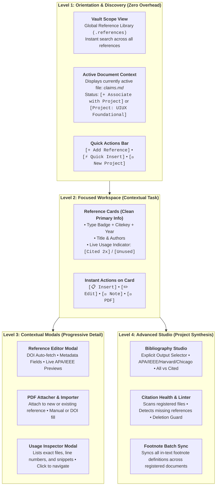

# Obsidian Citation Manager & Reference Studio

A project-centric, native reference manager, live citation indexer, linter, and bibliography studio for Obsidian with `.references` folder integration.

Developed in `F:/.repo/obsidian-citation-manager` and integrated directly with your Obsidian vault.

---

## UX Progressive Disclosure Architecture



---

## Key Capabilities

### 1. Root `.references` Storage Architecture
- All reference metadata notes are stored in a designated folder at the root of your vault (default `.references/`, configurable in settings).
- Direct disk-adapter synchronization guarantees zero cache delay when reading, adding, or modifying references.
- Local PDF attachments are automatically organized in `.references/attachments/<citekey>.pdf`.

### 2. Side Panel & Project Registry
- **Global Project Registry**: Associate markdown documents to citation projects directly from the side panel UI without polluting note frontmatter.
- **Active Document Context Banner**: Live visual indicator showing whether the note currently in your editor is registered or unregistered, with one-click `[+ Add to Project]` and `[Unlink]`.
- **Default to All References**: Never forces a dummy default project; defaults to `🌐 All References` so you can immediately see and use your vault library.

### 3. Real-Time Link Health & Diagnostic Telemetry
- **Live Counters**:
  - Total project references in `.references`
  - Total in-body citation instances across registered files
  - Used vs. Unused references
- **Unresolved Citation Linter**: Scans registered documents and flags any in-text citation keys or footnotes (`[^key]`, `[@key]`, `[[key]]`) that are missing corresponding `.references` metadata notes.
- **Deletion Guard**: Prevents accidental deletion of references that are actively cited in registered files. Clicking delete on an in-use reference presents a modal showing every file, line number, and snippet where it is cited.

### 4. Multi-Source Resolver & PDF Import Studio
- **PDF Importer Modal**: Dropping a PDF opens an intuitive modal asking whether to create a new reference (with optional DOI auto-fill) or attach to an existing reference.
- **Instant Metadata Resolvers**:
  - **DOI**: Multi-stage resolution via Crossref API, CSL-JSON content negotiation, and Semantic Scholar.
  - **arXiv**: Fetches preprint metadata and links.
  - **ISBN**: Queries OpenLibrary and Google Books for book metadata.
  - **Websites & Blogs**: Scrapes OpenGraph title, author, date, and publisher.
  - **YouTube**: Auto-resolves video author, title, and date via oEmbed.
  - **BibTeX**: Direct parsing of `@article`, `@inproceedings`, `@book`, `@misc` snippets.

### 5. Multi-Style Citation Generator & In-Editor Autocomplete
- **CSL Citation Styles**: APA 7th Edition, IEEE, Harvard, Chicago (Author-Date), and Vancouver (Numeric).
- **In-Editor Autocomplete (`EditorSuggest`)**: Type `[@`, `\cite{`, or `((` anywhere in an active note to trigger instant fuzzy-autocomplete.
- **Editor Context Menu**: Right-click in any Markdown note $\to$ `Insert Citation...` or `Register file to project`.
- **In-Text Footnote Synchronizer**: One-click button updates all formatted footnote definitions across all registered project documents whenever reference metadata is edited.
- **Explicit Bibliography Studio**: Configure explicit output destinations (Clipboard, Append `## References` to document, or Export to a customizable vault file).

---

## Commands & Shortcuts

| Command | Action |
| :--- | :--- |
| `Citation Manager: Open Citation Studio Panel` | Reveals the sidebar reference panel in the right sidebar. |
| `Citation Manager: Insert Citation at Cursor` | Opens a fuzzy-search modal to insert formatted citation at active cursor. |
| `Citation Manager: Quick Add Reference (DOI / URL / ISBN / BibTeX)` | Quick prompt to add any academic identifier directly from palette. |
| `Citation Manager: Register Current File to Active Citation Project` | Adds the active note to the current citation project scope. |
| `Citation Manager: Generate Project Bibliography` | Opens the Bibliography preview and export modal. |
| `Citation Manager: Synchronize In-Text Footnotes in Project` | Scans registered documents and updates all footnote definitions to latest metadata. |

---

## Development

```bash
# Build production bundle with Bun
bun run build

# Watch mode
bun run dev
```
