# Obsidian Citation Manager & Reference Studio

A project-centric, local-first academic reference manager, live citation indexer, linter, and publication export studio for Obsidian with `.references` folder integration.

---

## Architectural Principles

1. **Local-First & Markdown Native**: All reference metadata notes are stored as individual Markdown files inside `.references/` (or your configured root directory). No proprietary databases, no cloud dependencies, and zero vendor lock-in.
2. **Authoritative Academic Standards**: Citation styles (APA 7th Edition, IEEE, Harvard, Chicago Author-Date, Vancouver) govern both in-body citations and reference lists consistently per project bucket.
3. **Non-Destructive Footnote Mode**: Obsidian Footnote Mode (`[^citekey]`) is a toggleable companion setting for seamless Obsidian Footnotes plugin drafting, automatically converted to clean target standards upon publication export without data loss.
4. **Interactive Diagnostic Telemetry**: Continuous background indexing detects formatting mismatches, style anomalies, and unresolved citation stubs with unified one-click resolution workflows.

---

## Complete UX Pathways & Entry Points

```mermaid
flowchart TD
    subgraph INGESTION["1. Reference Ingestion & Attachment"]
        I1["<b>Search Island</b><br/>Type DOI, arXiv, ISBN, URL &rarr; Enter"]
        I2["<b>+ New Citation CTA</b><br/>Manual creation or quick identifier resolution"]
        I3["<b>PDF Dropzone</b><br/>Drag &amp; drop PDF binary &rarr; Auto DOI scan &amp; verification"]
    end

    subgraph SCOPE["2. Bucket & Scope Management"]
        B1["<b>Project Buckets</b><br/>Isolate literature by manuscript / thesis scope"]
        B2["<b>Citation Standard Selector</b><br/>Authoritative style per bucket (APA, IEEE, Vancouver, etc.)"]
        B3["<b>Linked Documents Bar</b><br/>One-click note linking &amp; frontmatter binding"]
    end

    subgraph DRAFTING["3. Drafting & Insertion Entry Points"]
        D1["<b>In-Editor Autocomplete</b><br/>Type <code>[@</code>, <code>\\cite{</code>, or <code>((</code> anywhere"]
        D2["<b>Insert Citation Modal</b><br/>Fuzzy search &bull; Shift+Click multi-citation chips"]
        D3["<b>Editor Context Menu</b><br/>Right click &rarr; Insert Citation..."]
        D4["<b>Command Palette</b><br/><code>Ctrl/Cmd + P</code> &rarr; Quick Add / Insert"]
    end

    subgraph DIAGNOSTICS["4. Link Diagnostics & Linter Engine"]
        L1["<b>Real-time Metric Tiles</b><br/>Total, In-Text Instances, Used vs. Unused"]
        L2["<b>Inconsistency Detection</b><br/>Format mismatches, nth footnote styles, unresolved stubs"]
        L3["<b>Fix Inconsistencies Modal</b><br/>&bull; Batch format correction<br/>&bull; + Create Reference Entry<br/>&bull; Purge stub from note<br/>&bull; Dismiss warning to cache"]
    end

    subgraph EXPORT["5. Bibliography & Publication Studio"]
        E1["<b>Live Monospace Preview</b><br/>Displays formatted reference list for cited items"]
        E2["<b>Quick Actions Island</b><br/>&bull; Copy to Clipboard<br/>&bull; Append <code>## References</code> to Note"]
        E3["<b>Publication Export Studio</b><br/>&bull; Footnote-to-citation conversion<br/>&bull; Frontmatter sanitation<br/>&bull; Clean compiled output"]
    end

    INGESTION --> SCOPE
    SCOPE --> DRAFTING
    DRAFTING --> DIAGNOSTICS
    DIAGNOSTICS --> EXPORT
```



---

## Detailed UX Walkthrough

### 1. Ingestion & Attachment
* **Instant Identifier Resolution**: Type any DOI (`10.1145/...`), arXiv ID (`2301.07041`), ISBN, or URL into the top search bar and press **Enter** to instantly fetch full metadata and open the editor modal.
* **PDF Attachment & DOI Verification**: When editing or adding a citation, drag and drop a PDF file into the dropzone. The engine scans the PDF binary for an embedded DOI and compares it against your citation metadata:
  * `✓ DOI Match Verified`: Confirms the PDF matches the citation record.
  * `⚠ DOI Mismatch Warning`: Flags if the PDF's internal DOI differs from the entry.
  * `ℹ DOI Status`: Notes if no DOI was detectable in scanned OCR text.

### 2. Drafting & In-Text Insertion
* **In-Editor Autocomplete (`EditorSuggest`)**: Trigger citation suggestions anywhere in your active document by typing:
  * `[@` (Pandoc citekey trigger)
  * `\cite{` (LaTeX trigger)
  * `((` (Double parenthesis trigger)
* **Multi-Citation Insert Modal**: Press `Ctrl/Cmd + Shift + I` (or use context menu) to open the multi-citation picker. Hold `Shift` while clicking to assemble multiple citations into a single group (e.g. `(Spielberg et al., 2016; Thériault et al., 2022)` or `[^Spielberg2016][^Thériault2022]`).

### 3. Footnote Mode & Synchronization
* **Global Companion Setting**: Managed under **Obsidian Settings -> Citation Manager -> Enable Obsidian Footnote Mode**.
* **Global Propagation**: Toggling Footnote Mode on or off automatically synchronizes all registered notes across your vault, converting between `[^citekey]` footnotes and your bucket's native in-body citation standard.

### 4. Citation Diagnostics & Automated Linter
* **Status Bar & Diagnostics Panel**: The panel header and status bar highlight active diagnostic warnings across linked notes.
* **Consolidated Unresolved Stubs**: Unresolved citekeys in-text and their bottom footnote definitions are consolidated into a single actionable incident.
* **Action Decision Tree in Fix Modal**:
  * **`+ Create Entry`**: Launches the reference editor pre-filled with the citekey and note definition text.
  * **`Purge`**: Strips the invalid reference token and definition from the note.
  * **`Dismiss`**: Silences the warning, persisting the state to `.references/.cache/dismissed_lints.json`.

### 5. Publication Export Studio
* **Sanitized Standalone Output**: Strips internal frontmatter keys (`projects`, etc.), converts `[^citekey]` footnote tokens into authoritative academic citations, appends the complete formatted bibliography, and exports the clean note to your designated publication directory.

---

## Commands & Shortcuts

| Command | Action |
| :--- | :--- |
| `Citation Manager: Open Panel` | Opens the Citation Studio right sidebar. |
| `Citation Manager: Insert Citation` | Opens the search and multi-select insert modal. |
| `Citation Manager: Quick Add Citation` | Quick identifier prompt (DOI / arXiv / URL / ISBN / Manual). |
| `Citation Manager: Link File to Bucket` | Associates the active note with the selected project bucket. |
| `Citation Manager: Generate Project Bibliography` | Opens the Bibliography preview and export subpanel. |
| `Citation Manager: Export for Publication` | Opens the publication export modal for active note. |

---

## Development

```bash
# Build production bundle with Bun
bun run build

# Watch mode for active development
bun run dev
```
