# Obsidian Citation Manager & Reference Studio

[](https://obsidian.md)
[](https://opensource.org/licenses/MIT)
[](https://citationstyles.org/)

A project-centric academic reference manager, live citation indexer, diagnostic linter, and publication export studio for [Obsidian](https://obsidian.md). Uses a local `.references/` folder to store notes.

---

## Key Highlights

- **Local-First and Markdown Native**: Stores all reference records and notes as Markdown files in `.references/` with YAML frontmatter. Uses no cloud databases and no external servers.
- **5 Academic Standards**: Full CSL implementations for **APA 7th Edition**, **IEEE [1]**, **Harvard (Author Year)**, **Chicago 17th Author-Date**, and **Vancouver (1)**.
- **Citation Buckets**: Group notes by manuscript scope. Each bucket controls its citation standard, linked files, and sequential numeric indexing.
- **Citation Collections**: Organize literature across buckets with color-coded groups and multi-filter controls.
- **In-Editor Autocomplete**: Suggests citations at the cursor when you type `[@`, `\cite{`, or `((`.
- **Diagnostic Linter Engine**: Scans linked documents in real time for orphan definitions, missing citekeys, and style mismatches. Offers batch repair controls.
- **Obsidian Footnotes Companion**: Draft notes with `[^citekey]` footnote callouts. Converts footnotes to target citation styles during export.
- **Surfing and Web Viewer Support**: Opens external study sources (DOI, arXiv, URL) directly in Surfing tabs or in the native Obsidian Web Viewer.
- **Publication Export Studio**: Cleans internal tags, converts footnotes into citations, creates sorted bibliographies, and exports standalone notes.

---

## Architectural Workflow

```mermaid
flowchart TD
    subgraph INGESTION["1. Reference Ingestion & Attachment"]
        I1["<b>Search Island</b><br/>Type DOI, arXiv, ISBN, URL &rarr; Enter"]
        I2["<b>+ New Citation CTA</b><br/>Manual creation or quick identifier resolution"]
        I3["<b>PDF Dropzone</b><br/>Drag &amp; drop PDF binary &rarr; Auto DOI scan &amp; verification"]
    end

    subgraph SCOPE["2. Buckets & Collections"]
        B1["<b>Citation Buckets</b><br/>Isolate literature &amp; styles by manuscript scope"]
        B2["<b>Citation Collections</b><br/>Cross-bucket tags &amp; two-column transfer modal"]
        B3["<b>Linked Documents Bar</b><br/>One-click note linking &amp; frontmatter binding"]
    end

    subgraph DRAFTING["3. Drafting & In-Text Insertion"]
        D1["<b>In-Editor Autocomplete</b><br/>Type <code>[@</code>, <code>\\cite{</code>, or <code>((</code> anywhere"]
        D2["<b>Insert Citation Modal</b><br/>Fuzzy search &bull; Shift+Click multi-citation chips"]
        D3["<b>Footnote Mode Toggle</b><br/>Draft non-destructively with <code>[^citekey]</code>"]
    end

    subgraph DIAGNOSTICS["4. Diagnostics & Linter Engine"]
        L1["<b>Real-time Telemetry</b><br/>Total, In-Text Instances, Used vs. Unused"]
        L2["<b>Interactive Accordion</b><br/>Format mismatches, orphan definitions, unlinked stubs"]
        L3["<b>Fix Inconsistencies Modal</b><br/>Checkbox batch fixes, stub creation, and purging"]
    end

    subgraph EXPORT["5. Publication Studio & Browser"]
        E1["<b>Surfing &amp; Web Viewer</b><br/>Click card to browse DOI/arXiv inside Obsidian"]
        E2["<b>Live Bibliography Preview</b><br/>Real-time sorted reference list for cited items"]
        E3["<b>Export for Publication</b><br/>Footnote conversion, frontmatter cleaning &amp; export"]
    end

    INGESTION --> SCOPE
    SCOPE --> DRAFTING
    DRAFTING --> DIAGNOSTICS
    DIAGNOSTICS --> EXPORT
```



---

## Installation

### Method 1: Obsidian Community Plugins
1. Open Obsidian **Settings** &rarr; **Community plugins**.
2. Turn off **Restricted mode**.
3. Click **Browse** and search for `Citation Manager`.
4. Click **Install**, then click **Enable**.

### Method 2: Obsidian BRAT
1. Install and enable the [BRAT plugin](https://github.com/TfTHacker/obsidian42-brat).
2. Open BRAT settings &rarr; **Add Beta plugin**.
3. Enter the repository URL: `https://github.com/SlamTheDragon/obsidian-citation-manager`.
4. Click **Add Plugin** and enable **Citation Manager** under Community Plugins.

### Method 3: Manual Installation
1. Download `main.js`, `manifest.json`, and `styles.css` from the [Releases](https://github.com/SlamTheDragon/obsidian-citation-manager/releases) page.
2. In your Obsidian vault, open `.obsidian/plugins/`.
3. Create a folder named `citation-manager/` and move the three files into it.
4. Reload Obsidian. Enable **Citation Manager** in **Settings &rarr; Community plugins**.

---

## Feature Guide

### 1. Ingestion
- **Identifier Resolution**: Type any DOI (`10.1145/3313831`), arXiv ID (`2301.07041`), ISBN (`9780465050659`), or URL into the search bar. Press **Enter** to fetch metadata from CrossRef, arXiv, or OpenLibrary.
- **PDF Dropzone**: Drag and drop a PDF file into the editor modal. The plugin scans binary streams for embedded DOIs, compares them with metadata, and confirms matches.
- **BibTeX Import**: Import single entries or complete `.bib` files into `.references/`.

### 2. Buckets and Collections
- **Citation Buckets**: Represent distinct research scopes such as chapters or papers.
  - Buckets control the active citation standard (such as IEEE or APA 7).
  - Buckets control sequential numeric indexing across all linked notes.
  - You can edit bucket names in the **Bucket Settings** subpanel.
- **Citation Collections**: Represent organizational groups across buckets.
  - Filter references with the 4-state filter island.
  - Move citations between collections with the two-column transfer modal.

### 3. Drafting and Insertion
- **In-Editor Suggestions**: Type `[@`, `\cite{`, or `((` to open the autocomplete popup. Select an entry to insert it in your bucket's active style.
- **Multi-Citation Modal (`Ctrl/Cmd + Shift + I`)**: Search references. Hold `Shift` to select multiple papers. The engine groups and sorts them automatically:
  - APA 7: `(Carter et al., 2026; Li, 2024; Norman, 2013)`
  - IEEE: `[1, 3, 5]`
  - Vancouver: `(1, 3, 5)`

### 4. Diagnostic Linter Engine
- **Continuous Verification**: Scans linked documents for format deviations, orphan footnote definitions, and unresolved citekeys.
- **Batch Fix Modal**: Shows issues in expandable accordions with before-and-after previews. Select checkboxes and click **Apply Selected Fixes** to repair issues in one step.

### 5. Plugin Integrations
- **Obsidian Footnotes Companion**: Enable Footnote Mode in settings. Inserting a citation adds a `[^citekey]` callout at the cursor and a definition at the bottom. Exporting for publication converts footnotes back into citations.
- **Surfing and Web Viewer**: Citation cards with a DOI, arXiv ID, or URL contain source links. Clicking a card opens the source in a Surfing tab, in the native Web Viewer, or in your default browser.

---

## Commands and Shortcuts

| Command | Default Shortcut | Description |
| :--- | :--- | :--- |
| `Citation Manager: Open Panel` | `Alt + C` | Opens the Citation Studio sidebar view. |
| `Citation Manager: Insert Citation` | `Ctrl/Cmd + Shift + I` | Opens the search and insert modal. |
| `Citation Manager: Quick Add Citation` | — | Opens the quick identifier resolution prompt. |
| `Citation Manager: Link File to Bucket` | — | Links the active document to the active bucket. |
| `Citation Manager: Generate Bibliography` | — | Shows the bibliography modal for the active bucket. |
| `Citation Manager: Resync Notes in Bucket` | — | Verifies and syncs footnote definitions. |
| `Citation Manager: Export for Publication` | — | Opens the publication export studio. |

---

## Technical Documentation

Technical specifications and guides are available in the [`docs/`](./docs/) directory:

- [**Architecture & Subsystem Decomposition**](./docs/ARCHITECTURE.md): Class layout, data flows, and state machines.
- [**Schema Specifications**](./docs/SCHEMAS.md): TypeScript and JSON schemas for references, buckets, collections, and settings.
- [**CSL Academic Standards Guide**](./docs/STANDARDS.md): Formatting rules for APA 7, IEEE, Harvard, Chicago, and Vancouver.
- [**Diagnostic Linter Rules**](./docs/LINTING_RULES.md): Rule list, severity ratings, and automated repair logic.
- [**Contributing Guide**](./docs/CONTRIBUTING.md): Environment setup, Bun test suite, and coding rules.
- [**Release & Community Discovery Guide**](./docs/RELEASE_AND_DISCOVERY.md): Version bumping, GitHub Actions release pipeline, and Obsidian directory submission.

---

## License

This project is licensed under the [MIT License](./LICENSE).

---

## Development

```bash
# Build production bundle with Bun
bun run build

# Watch mode for active development
bun run dev
```
