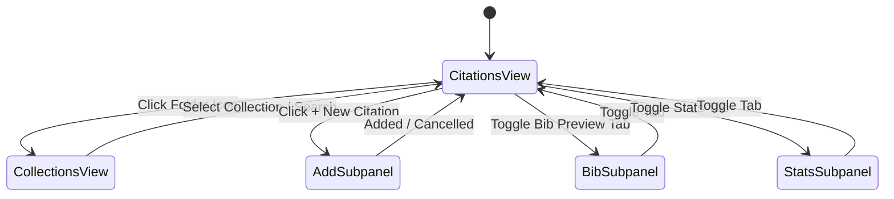

# Obsidian Citation Manager — Architecture & Subsystems

This document provides a deep technical overview of the architecture, module decomposition, data flow, and invariant contracts governing the **Obsidian Citation Manager** plugin.

---

## 1. System Decomposition & Module Layering

The plugin is structured into distinct, modular functional layers:

```
+-------------------------------------------------------------------------+
|                              VIEWS LAYER                                |
|  CitationManagerView (FSM)  •  Modals (Editor, Insert, Export, Transfer)|
|  Components: CitationCardRenderer, FilterIsland, AccordionRenderer      |
+-------------------------------------------------------------------------+
                                    │
                                    ▼
+-------------------------------------------------------------------------+
|                           ORCHESTRATION LAYER                           |
|  ProjectIndexer: Cross-doc indexing, sequential numbering, compilation  |
|  LintEngine: Inconsistency detection, diff generation, batch repair     |
+-------------------------------------------------------------------------+
                    │                                   │
                    ▼                                   ▼
+------------------------------------+ +----------------------------------+
|           STORAGE LAYER            | |            CSL ENGINE            |
|  StorageManager: .references/      | |  APA7, IEEE, Harvard, Chicago,   |
|  YAML frontmatter, Note boundaries | |  Vancouver, Name Parsers, Group  |
+------------------------------------+ +----------------------------------+
                    │
                    ▼
+-------------------------------------------------------------------------+
|                              RESOLVERS                                  |
|  DOI (CrossRef) • arXiv API • OpenLibrary (ISBN) • PDF Binary Scanner   |
+-------------------------------------------------------------------------+
```

---

## 2. Core Subsystem Responsibilities

### A. CSL Formatting Engine (`src/csl/`)
* **Pure Functional Formatting**: Independent formatters implement authoritative academic style manuals without side effects:
  - `apa7Formatter.ts`: APA 7th Edition (Author, Year) in-body and bibliography.
  - `ieeeFormatter.ts`: IEEE numeric bracket [1] indexing and citation lists.
  - `harvardFormatter.ts`: Harvard (Author Year) parenthetical without comma between author and year.
  - `chicagoFormatter.ts`: Chicago 17th Edition Author-Date format.
  - `vancouverFormatter.ts`: Vancouver numeric parenthesis (1) indexing.
* **Name & Case Normalizer (`nameParser.ts`)**: Splits compound surnames (e.g. "van der Waals", "de Silva"), normalizes title casing, and parses BibTeX author lists.
* **Compound In-Body Merging**: Coalesces adjacent citations into sorted academic groups:
  - APA 7: `(Carter et al., 2026; Li, 2024; Norman, 2013)`
  - IEEE: `[1, 3, 5]`
  - Vancouver: `(1, 3, 5)`

### B. Metadata Resolvers (`src/resolvers/`)
* **CrossRef / DOI Resolver**: Normalizes raw DOI strings into canonical HTTPS URLs and queries CrossRef for high-fidelity JSON metadata.
* **arXiv Resolver**: Queries the arXiv Atom API, extracting authors, summary, publication date, and associated DOI.
* **OpenLibrary ISBN Resolver**: Queries OpenLibrary Books API for academic book metadata, publishers, and publication years.
* **PDF Stream Scanner**: Scans local PDF binary headers via regex pattern matching across uncompressed text streams to automatically extract embedded DOIs.

### C. Storage & Persistence Layer (`src/storageManager.ts`)
* **Local-First Markdown Notes**: Every citation is serialized as an individual Markdown note in `.references/<citekey>.md`.
* **YAML Frontmatter Mapping**: Metadata fields (`title`, `authors`, `year`, `doi`, `projects`, etc.) are serialized to YAML frontmatter.
* **Note Boundary Governance**: User literature notes and annotations are strictly wrapped inside `<!--NOTE_START-->` and `<!--NOTE_END-->` comments, preventing metadata sync operations from corrupting human-written notes.
* **Cache Management**: Fast non-blocking storage in `.references/.cache/collections.json` and `.references/.cache/dismissed_lints.json`.

### D. Project Indexer & Corpus Compiler (`src/projectIndexer.ts`)
* **Cross-Document Telemetry**: Scans all registered notes in an active Bucket to compute citation frequencies, active references, and unused citations.
* **Sequential Numeric Indexing**: Assigns sequential indices (`[1..N]` for IEEE, `(1..N)` for Vancouver) governed strictly by appearance order across linked notes in a Bucket.
* **Corpus Batch Export**: Produces sanitized publication notes with footnote-to-token conversion and compiles master bibliographies.

### E. Diagnostic Linter Engine (`src/lintEngine.ts`)
* **Automated Rule Evaluation**: Compares in-text citations against the active bucket's citation standard, flagging format mismatches, unlinked citekeys, and orphan footnote definitions.
* **Levenshtein Distance Matching**: Recommends near-match citekeys for typographical errors in document drafts.

---

## 3. Finite State Machine (FSM) in Side Panel View

The side panel UI operates as a deterministic finite state machine with 5 core views:



---

## 4. Invariant Contracts

1. **Zero Unicode Emojis**: User interfaces, notification notices, logs, and generated notes MUST use Lucide SVG icons exclusively.
2. **Non-Destructive Footnote Mode**: Toggling Footnote Mode converts references safely between `[^citekey]` callouts and standard tokens without data loss.
3. **Single Source of Truth**: Reference metadata in `.references/*.md` is the authoritative data source.
