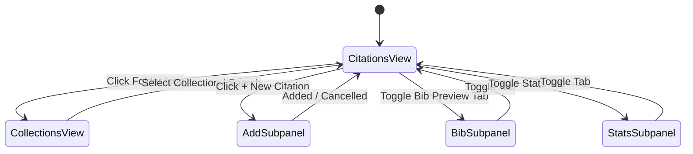

# Obsidian Citation Manager — Architecture & Subsystems

This document describes the software architecture, module layout, data flow, and design rules for the **Obsidian Citation Manager** plugin.

---

## 1. System Decomposition & Module Layering

The plugin contains five modular layers:

```
+-------------------------------------------------------------------------+
|                              VIEWS LAYER                                |
|  CitationManagerView (FSM)  •  Modals (Editor, Insert, Export, Transfer)|
|  Components: CitationCardRenderer, FilterIsland, AccordionRenderer      |
+-------------------------------------------------------------------------+
                                    │
                                    ▼
+-------------------------------------------------------------------------+
|                           ORCHESTRATION LAYER                           |
|  ProjectIndexer: Cross-doc indexing, sequential numbering, compilation  |
|  LintEngine: Inconsistency detection, diff generation, batch repair     |
+-------------------------------------------------------------------------+
                    │                                   │
                    ▼                                   ▼
+------------------------------------+ +----------------------------------+
|           STORAGE LAYER            | |            CSL ENGINE            |
|  StorageManager: .references/      | |  APA7, IEEE, Harvard, Chicago,   |
|  YAML frontmatter, Note boundaries | |  Vancouver, Name Parsers, Group  |
+------------------------------------+ +----------------------------------+
                    │
                    ▼
+-------------------------------------------------------------------------+
|                              RESOLVERS                                  |
|  DOI (CrossRef) • arXiv API • OpenLibrary (ISBN) • PDF Binary Scanner   |
+-------------------------------------------------------------------------+
```

---

## 2. Core Subsystem Responsibilities

### A. CSL Formatting Engine (`src/backend/csl/`)
- **Functional Formatters**: Formatters implement academic style manuals:
  - `cslFormatters.ts`: APA 7th Edition (Author, Year) in-body and bibliography, IEEE numeric bracket [1], Harvard (Author Year), Chicago 17th, Vancouver (1).
  - `cslSorter.ts`: Multi-tier academic reference sorting.
  - `bibtexGenerator.ts`: BibTeX serializer with ISSN/ISBN/DOI/abstract support.
- **Compound Merging**: Merges adjacent citations into sorted groups:
  - APA 7: `(Carter et al., 2026; Li, 2024; Norman, 2013)`
  - IEEE: `[1, 3, 5]`
  - Vancouver: `(1, 3, 5)`

### B. Metadata Resolvers (`src/backend/resolvers/`)
- **CrossRef DOI Resolver**: Converts raw DOI strings into HTTPS URLs and queries CrossRef for metadata.
- **arXiv Resolver**: Queries the arXiv Atom API to get authors, summaries, publication dates, and associated DOIs.
- **OpenLibrary ISBN Resolver**: Queries OpenLibrary Books API for book metadata, publishers, and publication years.
- **PDF Stream Scanner**: Scans PDF binary headers with regex patterns to extract embedded DOIs.

### C. Storage and Persistence (`src/backend/storageManager.ts`)
- **Local Markdown Notes**: Stores each reference as a Markdown note in `.references/<citekey>.md`.
- **YAML Frontmatter**: Saves metadata fields (`title`, `authors`, `year`, `doi`, `projects`) into note frontmatter.
- **Note Boundaries**: Wraps user notes inside `<!--NOTE_START-->` and `<!--NOTE_END-->` tags. This prevents metadata updates from changing user notes.
- **Settings**: Plugin settings persist in Obsidian's standard `data.json`.
- **Cache Storage**: Saves quick cache data in `.references/.cache/collections.json` and `.references/.cache/dismissed_lints.json`.

### D. Project Indexer & Corpus Compiler (`src/backend/projectIndexer.ts`)
- **Document Telemetry**: Scans linked notes in a bucket to compute citation counts and identify unused references.
- **Numeric Indexing**: Computes sequential numbers (`[1..N]` for IEEE, `(1..N)` for Vancouver) based on citation order across linked notes.
- **Corpus Batch Export**: Converts footnotes to citations, cleans frontmatter, and creates master bibliographies.

### E. Diagnostic Linter Engine (`src/backend/lintEngine.ts`)
- **Rule Verification**: Compares in-text citations against the active bucket standard. Flags format errors, missing citekeys, and orphan definitions.
- **Fuzzy Search**: Uses Levenshtein distance to recommend corrections for mistyped citekeys.

---

## 3. Finite State Machine in Side Panel View

The side panel UI uses a finite state machine with five primary views:



---

## 4. Invariant Contracts

1. **Zero Unicode Emojis**: Use Lucide SVG icons exclusively in UI views, notices, modals, and logs.
2. **Safe Footnote Mode**: Convert references between `[^citekey]` callouts and standard citation tokens without data loss.
3. **Single Source of Truth**: Treat metadata in `.references/*.md` as the authoritative record.

---

## 5. Source Tree Layout & Build Packaging

The repository isolates source code and static assets from generated release artifacts:

- **`src/`**: Contains TypeScript source files.
- **`public/`**: Stores static assets (`public/manifest.json` and `public/styles.css`). This keeps the root directory clean.
- **`dist/`**: Holds generated release artifacts (`main.js`, `manifest.json`, `styles.css`). The `.gitignore` file excludes `dist/` from version control.
- **Dynamic Online Bundling**: GitHub Actions compiles TypeScript online, copies `public/` assets to `dist/`, and publishes the release bundle to GitHub Releases.
